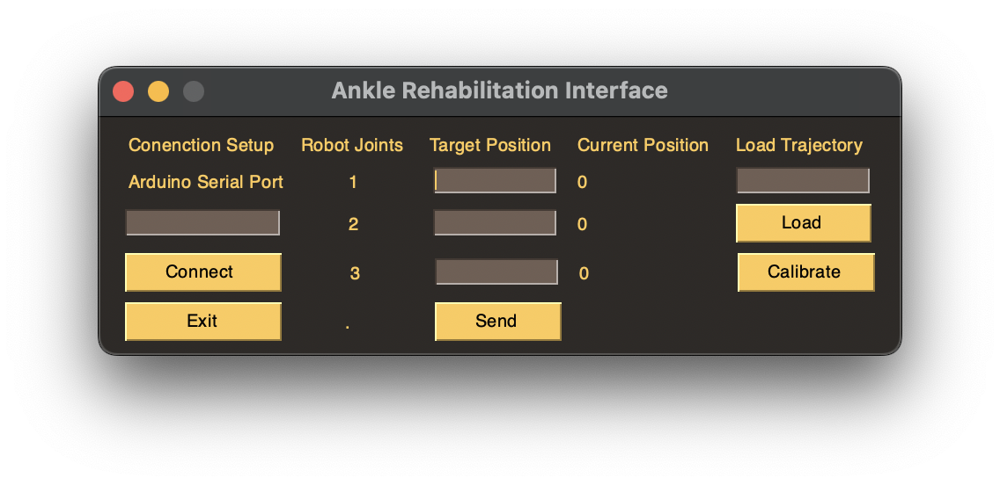
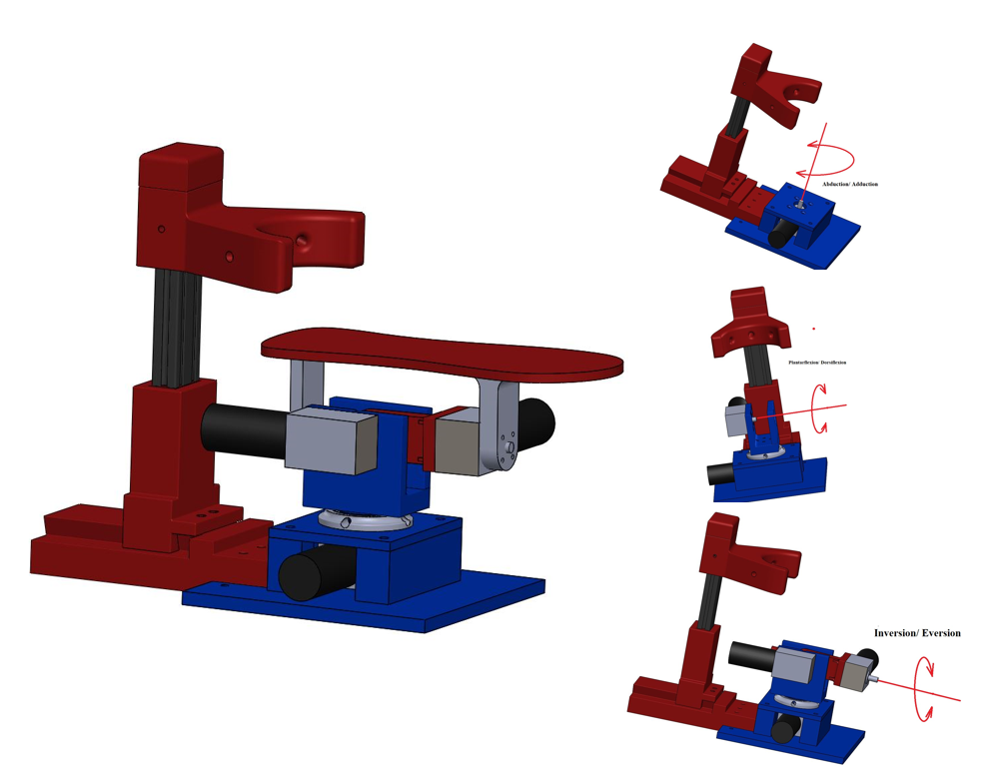
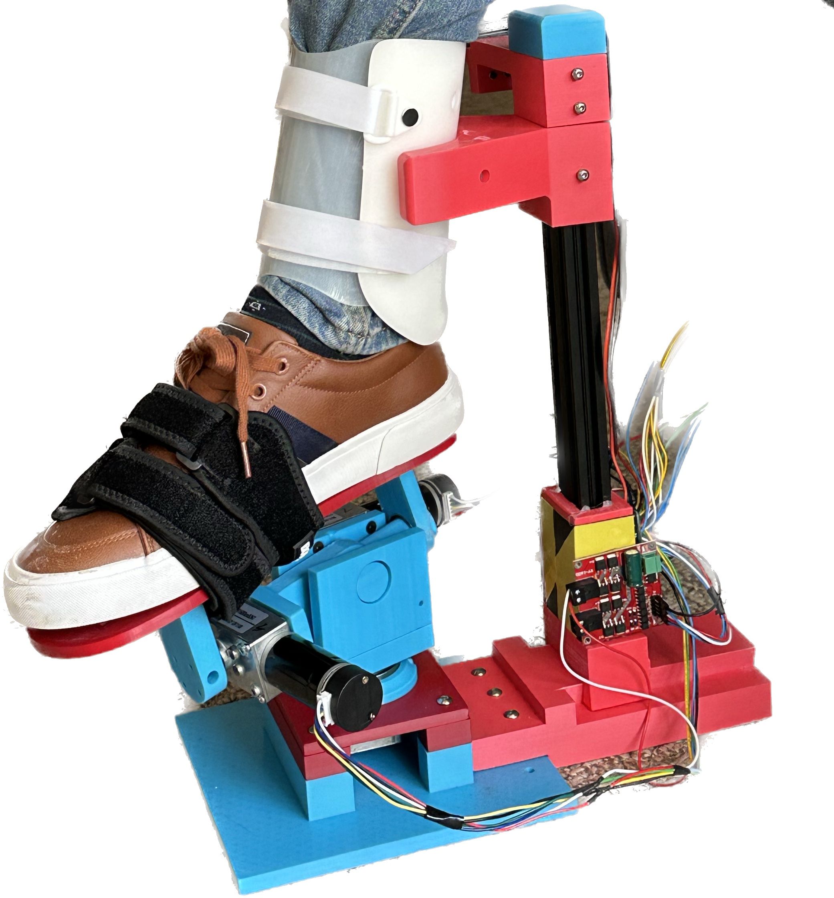
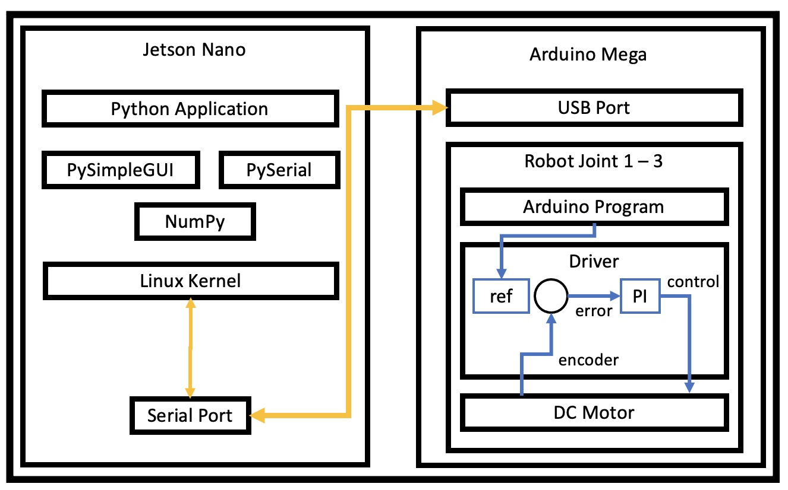
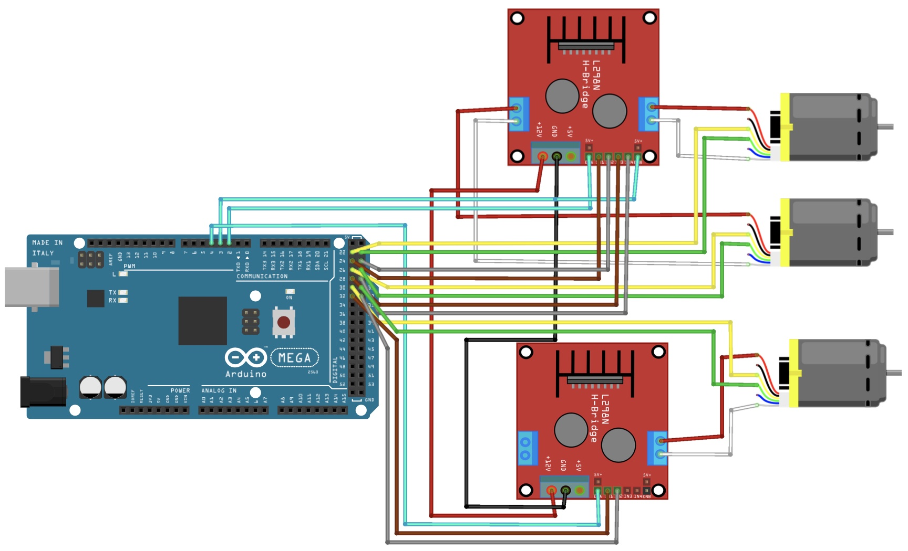

# AnkleRehabRobot
This Project aims to deliver a cheap and open-source rehabilitation robot for the ankle

  
   
  <b>Figure: Rehab Ankle Python GUI</b>

## 3D Model of the Robot

  
   
  <b>Figure: 3D Model of the Ankle Robot</b>

  
   
  <b>Figure: Final Setup of Robot</b>

## Components:
- Computer: Nvidia Jetson Nano
- Microcontroller: Arduino Mega
- Interface: LCD Touch Screen
Actuators: DC Motor Self-Locking Worm Gear Motor with Encoder
- Motor Driver: L298 Dual Bridge
- Voltage Regulator: 12/24V to 5V
- Limit Switches
- Power Supply: 24V

## System Architecture
Here we can see the distribution of the applications and responsibilities. The python program on the Jetson Nano runs the user interface and handles serial communications, data processing, and data logging. On the other side, there is the Arduino with its C-based code that listens for the command of the jetson and runs a closed loop position control based on the encoder read of the code.

  
   
  <b>Figure: System Architecture Diagram</b>

## Installation
For the installation of this project:
1. Clone this repository
2. on the root of the project run: pip install -r requirements.txt

## Arduino Setup

  
   
  <b>Figure: Arduino Motors Wiring Diagram</b>

Open the folder arduinoRehabAnkle in either ArduinoIDE, PlatformIO or the desired editor and load the [code](arduinoRehabAnkle/rehabAnkle.ino) into the development board 

From here you should determine the serial port that the arduino takes in the raspberry pi, run the following command:
- ls /dev/tty*

## Test Project
To test this project open a terminal on the root of the folder and run:
- python src/rehabGUI.py

